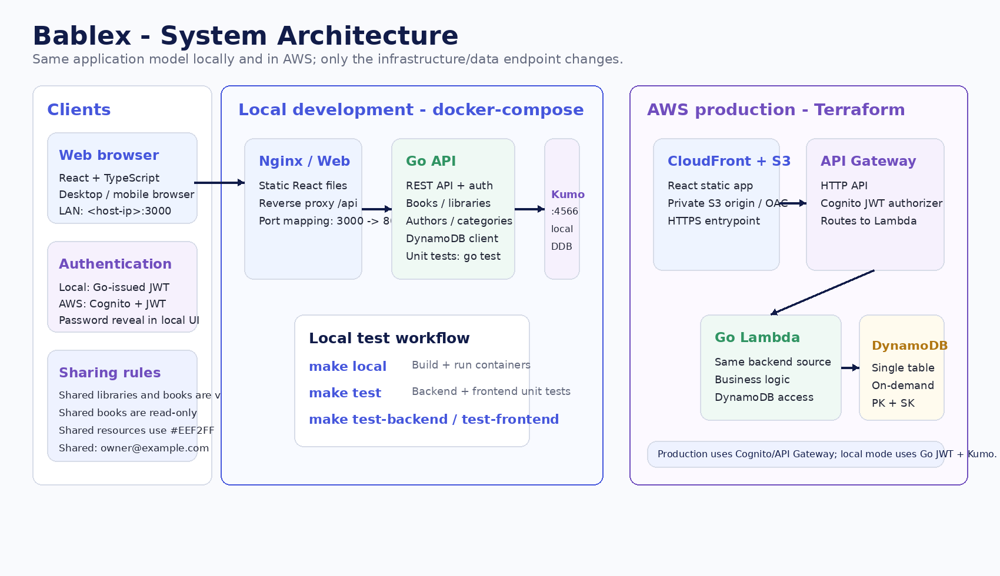
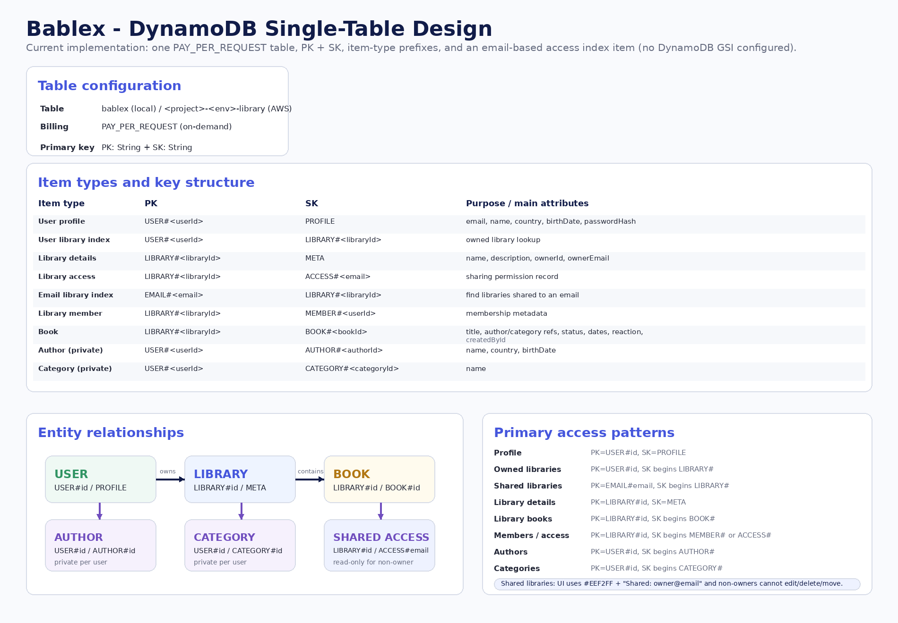

# Bablex - AWS + Kumo Local Development

Small multi-user library application designed for low cost in AWS and repeatable local testing with Kumo.

## Stack

Production:

- React + Vite + TypeScript
- S3 private bucket + CloudFront
- Amazon Cognito Managed Login
- API Gateway HTTP API + JWT authorizer
- Go AWS Lambda
- DynamoDB
- CloudWatch

Local:

- React + Vite served by Nginx
- Go API running in Docker
- Kumo emulating AWS services on `localhost:4566`
- DynamoDB persisted to a Docker volume
- Local Go authentication adapter with signed access/refresh tokens

Kumo is an AWS service emulator with Docker support, AWS SDK v2 compatibility, DynamoDB, S3, Cognito, API Gateway v2 and other services. It can persist service state under `KUMO_DATA_DIR`.

## Why local auth is different

The production browser flow uses Cognito Managed Login/Hosted UI. For a deterministic local Docker environment, the frontend switches to a small local authentication adapter implemented by the same Go API. The production build stays on Cognito + API Gateway JWT validation. Kumo provides the AWS-compatible local data plane used by the API.

## Run everything locally

Requirements:

- Docker Desktop with Compose

Start the full stack:

```bash
make local
```

Open:

```text
http://localhost:3000
```

The API is available at:

```text
http://localhost:8080

### Accessing local Bablex from another computer

The web container serves the frontend and proxies `/api/*` to the Go API container. This keeps the browser API URL relative to the Bablex host, so another computer on the same LAN does not try to call its own `localhost`.

Open Bablex using the Docker host machine's LAN IP, for example `http://192.168.1.50:3000`. Ensure the host firewall allows TCP port 3000.
```

Kumo is available at:

```text
http://localhost:4566
```

The first startup creates the DynamoDB table automatically. The Kumo data volume is persistent, so stopping and restarting the stack keeps local AWS-emulated state.

To reset all local data:

```bash
make local-reset
```

You can also use:

```bash
./local.sh
```

## Local test flow

1. Open `http://localhost:3000`.
2. Create a local account with an email and password of at least 8 characters.
3. Sign in.
4. Add, edit, search and delete books.
5. Open the application in another browser/profile and create another user to verify user isolation.
6. Restart Docker Compose and verify the DynamoDB data is still present.

Local authentication uses access tokens plus refresh tokens and stores the account record in Kumo's DynamoDB emulator. This is intentionally a development-only adapter; do not use it as the production identity system.

## Useful local commands

Health:

```bash
curl http://localhost:8080/health
```

Kumo's default endpoint is `4566` and its Compose setup supports persistence through `KUMO_DATA_DIR` and a volume.

## Deploy to AWS

The same backend switches back to AWS mode when `AUTH_MODE` is not `local`. Terraform configures Cognito, API Gateway, Lambda, DynamoDB, S3 and CloudFront. The AWS deployment is IP-restricted: CloudFront has an AWS WAF allowlist, and the Lambda API independently validates the caller source IP. The S3 bucket remains private behind CloudFront OAC; do not add an `aws:SourceIp` condition to the S3 bucket policy because CloudFront, not the viewer, is the S3 requester.

Build and deploy:

```bash
./deploy.sh
```

Or manually:

```bash
./build.sh
cd infra
terraform init
terraform apply
```

Terraform writes the production `config.json` so the frontend switches to the AWS Cognito flow automatically.

## Important environment split

AWS Lambda:

```text
AUTH_MODE=aws
AWS_ENDPOINT_URL=<unset>
```

Local Docker API:

```text
AUTH_MODE=local
AWS_ENDPOINT_URL=http://kumo:4566
AWS_REGION=us-east-1
TABLE_NAME=bablex
```

The DynamoDB access pattern is unchanged:

```text
PK = USER#<user-id>
SK = BOOK#<book-id>
```

That keeps one user's books isolated from another user's books.

## API

Production routes:

- `GET /health`
- `GET /books`
- `POST /books`
- `GET /books/{id}`
- `PATCH /books/{id}`
- `DELETE /books/{id}`

Local-only auth routes:

- `POST /auth/signup`
- `POST /auth/login`
- `POST /auth/refresh`

## Notes

The local password hashing/token code exists only to make the whole stack executable without an AWS account. Production authentication remains Cognito. Before a public launch, add rate limiting/WAF as appropriate, alarms, stronger observability, and a documented backup/recovery policy.


## Docker Compose compatibility

The Makefile supports both Docker Compose v2 (`docker compose`) and the legacy standalone command (`docker-compose`). The local target intentionally runs `build` and `up` as separate commands because some Docker CLI installations reject `up --build`. You can override the command explicitly with `make COMPOSE=docker-compose local`.

## Go dependency note

The backend intentionally declares only the AWS SDK modules imported directly by the application. The AWS SDK core `aws` module and other shared SDK modules are resolved transitively by Go from the selected `config` and `dynamodb` versions. Do not add a separately pinned `github.com/aws/aws-sdk-go-v2/aws` requirement unless the dependency graph specifically requires it.

## Go dependencies

The backend build generates `go.sum` with `go mod tidy`. For a normal checkout, run:

    make deps

and commit both `backend/go.mod` and `backend/go.sum`. The Docker local build also runs `go mod tidy` inside the build stage so a missing `go.sum` does not prevent the container from compiling.

## Library management features

The application now supports multiple named libraries. A library has a name, description, owner, and a list of users who can access it. Owners can share a library by email. Access pointers are stored by email so the invited user sees the library after signing in with that address.

Books are stored under a library rather than directly under a user. The Books page keeps the original card presentation and adds a table/card view toggle plus a library selector.

Authors and categories are private to each user. The book form uses selectors for existing authors/categories and allows a new value to be created inline when it does not exist. Author records support country and birth date, and the Authors screen shows books related to the selected author across libraries the current user can access.

The account screen stores personal name, country, and birth date. Local mode supports changing the password directly. AWS mode keeps password lifecycle in Cognito; password recovery/change should be performed through Cognito's authentication flow.

### New API surface

- `GET|PATCH /me`
- `POST /me/password` (local mode)
- `GET|POST /libraries`
- `GET|PATCH /libraries/{id}`
- `GET /libraries/{id}/access`
- `POST /libraries/{id}/share`
- `GET|POST /libraries/{id}/books`
- `PATCH|DELETE /libraries/{id}/books/{bookId}`
- `GET|POST /authors`
- `GET|PATCH /authors/{id}`
- `GET|POST /categories`

The DynamoDB table remains a single-table, on-demand design, so these features do not add fixed database infrastructure cost.

## Book registration and filtering

The Books page now defaults to **All Libraries** and can be switched to an individual accessible library. Card and table views remain available.

Book registration includes:
- Library selection
- Type-ahead Author and Category controls
- Existing reference selection or create-on-save when a new name is typed
- Automatic `registeredAt` timestamp
- Optional bought and read dates
- Like / dislike / neutral reaction

Authors and categories remain private to the authenticated user. A shared library does not make those reference records shared.

## Book and reference behavior

- The Books page keeps card/table views and supports `All Libraries` or a specific library.
- The Book form always allows changing the library, including while editing an existing book. Changing the library creates the book in the new library and removes it from the previous library after the new copy is created.
- Title is required.
- Author and Category are optional. While typing, the form searches the current user's private references. Selecting an existing entry stores its reference; typing a new name creates it only when the book is saved. Leaving the field empty creates no reference.
- Book dates include automatic `registeredAt` plus optional `boughtAt` and `readAt`.
- Book statuses include `Owned`, `Reading`, `Read`, `Wishlist`, `Lent`, `Sold`, and `Donated`.
- Like/dislike reaction is stored on the book and is visible in the main list.
- Delete uses DynamoDB `ALL_OLD` return values locally/in AWS to detect missing records instead of silently returning success.

## Authors and Categories pages

Authors and Categories use the same interaction pattern as Books: search, card/table view, an `All Libraries` filter for related-book results, editable detail panels, and related books shown in a table. Author and Category records remain private to each user.


## Startup data

Bablex does not create example or seed books when the application starts. Local Kumo data is preserved in its Docker volume until explicitly reset.

## UI release note - shared libraries and password visibility

The current UI includes an explicit password reveal control on local Sign in and Create account, exact `#EEF2FF` highlighting for shared book/library cards, and `Shared: <owner email>` labels for shared resources. The library picker shows the owner email only for shared libraries. The frontend index and runtime config are sent with no-cache headers so rebuilt local images do not keep serving a stale entrypoint.

## Tests

Install frontend dependencies once with:

```bash
cd frontend && npm install
```

Run all backend and frontend unit tests with:

```bash
make test
```

Run only backend tests with `make test-backend` or only frontend tests with `make test-frontend`.

Updated diagrams are in `docs/diagrams/`.

### Architecture diagrams





## Languages

Bablex supports English, Spanish, Portuguese, French, and German. The language selector in the authenticated header changes the application immediately, and the Personal Data page lets each user save a preferred language. The preference is stored as `preferredLanguage` on the user profile and is restored after login.

Books also have a `language` field in the Create/Edit Book form, displayed next to Library near the top of the form. The selector shows a flag, language acronym, and language name; stored values are `en`, `es`, `pt`, `fr`, or `de`.
## Book comments and library access removal

Existing books expose a comments section in both the edit view and the details view. Any user who can access the book's library can add a comment. Comments store the author user ID, display name, email, text, and UTC timestamp, and are shown newest first. Comments are stored under the book ID rather than the library ID so they survive a book move between owned libraries.

Library owners can remove a shared user's access from the library editor with the trash action. This removes both the library access record and the user's library index entry.

### Restrict AWS access to your personal IP

Set your public IPv4 as a /32 before `terraform apply`, for example:

```hcl
allowed_public_ipv4_cidrs = ["198.51.100.25/32"]
```

Get your own IP with this command
```sh
curl -4 https://checkip.amazonaws.com
```

This creates an AWS WAF allowlist on CloudFront. The same CIDR list is injected into Lambda so direct API calls from other IPs are rejected as well. If your ISP changes your public IP, update the CIDR and re-run `terraform apply`.

### AWS COST

| AWS service                     | What Bablex uses                                          |                                                              Estimated monthly |
| ------------------------------- | --------------------------------------------------------- | -----------------------------------------------------------------------------: |
| **S3**                          | Private frontend bucket, small amount of storage/requests |                                                                **$0.01–$0.05** |
| **CloudFront**                  | Serves React frontend, HTTPS                              |                                                                      **$0–$1** |
| **AWS WAF**                     | IP allowlist for your personal IP                         |                                                        **~$6 + request usage** |
| **API Gateway HTTP API**        | REST API requests to Lambda                               |                                                                   **$0–$0.05** |
| **Lambda**                      | Go backend, pay-per-request/duration                      |                               **$0** for this workload, often within free tier |
| **DynamoDB**                    | Single table, on-demand                                   |                                                                   **$0–$0.50** |
| **Cognito**                     | User authentication                                       | **$0** for a small personal user base, subject to current free-tier/MAU limits |
| **CloudWatch Logs**             | Lambda/API logs, 14-day retention                         |                                                                   **$0–$0.50** |
| **Route 53**                    | **Only if you add a custom domain**                       |                                                                    **~$0.50+** |
| **Total without custom domain** |                                                           |                                                               **~$6–$8/month** |
| **With custom domain**          |                                                           |                                                              **~$7–$10/month** |

